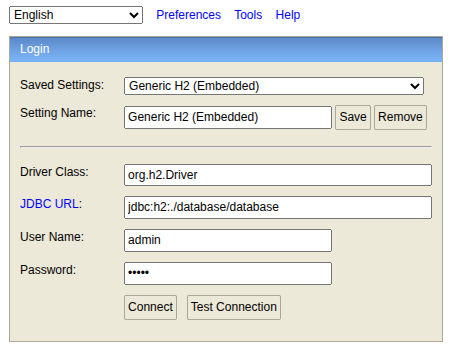
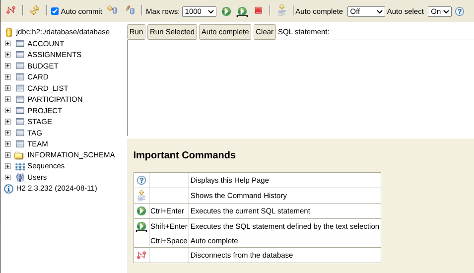

# Cardeeasy Plus

Uma reconstrução do [Cardeasy](https://github.com/Pedr0P4/Cardeasy).

- [Instruções para backend](#instruções-para-backend)
  - [Execução](#execução)
  - [Acesso e dados mockados](#acesso-e-dados-mockados)
- [Instruções para frontend](#instruções-para-frontend)
  - [Execução](#execução-1)
  - [Next.js](#nextjs)
  - [Bugs conhecidos](#bugs-conhecidos)

# Instruções para backend

É necessário ter o [Java 21](https://www.oracle.com/br/java/technologies/downloads/#java21) e o [Maven](https://maven.apache.org/) — estou usando a versão `3.8.7`, mas não acho que a versão se tornará um problema para você. Peço a cautela com a formatação do código, você certamente não estará programando algo que apenas você verá.

Sobre o ambiente, recomendo o uso do [VSCode](https://code.visualstudio.com/) com o [Extension Pack for Java](https://marketplace.visualstudio.com/items?itemName=vscjava.vscode-java-pack). Além disso, mesmo que não vá mexer no `frontend`, recomendo abrir o projeto inteiro, pois a referência para o arquivo do banco de dados [database](./database/database.mv.db) é relativa a pasta de `execução` do `backend` — e eu executei na raíz do projeto inteiro.

Como recomendações adicionais, recomendo as extensões [EditorConfig for VSCode](https://marketplace.visualstudio.com/items?itemName=EditorConfig.EditorConfig) e [Material Icon Theme](https://marketplace.visualstudio.com/items?itemName=PKief.material-icon-theme). Sendo o primeiro bem mais importante, e o segundo muito mais uma questão de customização.

## Execução

Você pode executar através do [Extension Pack for Java](https://marketplace.visualstudio.com/items?itemName=vscjava.vscode-java-pack). Ao executar o `backend`, o console do `H2` está disponível em `http://localhost:8080/console`. 

- O usuário e senha padrão é `admin`;
- O `JDBC URL` é `jdbc:h2:./database/database`;
- O `Driver` é `org.h2.Driver`.

A imagem abaixo ilustra a página de login do console.



A image abaixo ilustra o console após a autenticação bem sucedida.



## Acesso e dados mockados

Deixamos alguns dados `mockados` apenas para `testes` (alguns nomes e títulos podem não fazer muito sentido), pode alterar a vontade. Estão acessíveis através das contas:
- Marcel
  - E-mail: marcel@gmail.com
  - Senha: marcel
- Pedro
  - E-mail: pedro@gmail.com
  - Senha: pedro
- Eric
  - E-mail: eric@gmail.com
  - Senha: eric
- Artur
  - E-mail: artur@gmail.com
  - Senha: artur

# Instruções para frontend

É necessário ter o [Node 22](https://www.oracle.com/br/java/technologies/downloads/#java21) e o [Pnpm](https://pnpm.io/pt/installation) — estou usando a versão `10.14.0`, mas não acho que a versão se tornará um problema para você. Peço a cautela com a formatação do código, você certamente não estará programando algo que apenas você verá.

Sobre o ambiente, recomendo o uso do [VSCode](https://code.visualstudio.com/) com o [JavaScript and TypeScript Nightly](https://marketplace.visualstudio.com/items?itemName=ms-vscode.vscode-typescript-next) e o [Tailwind CSS IntelliSense](https://marketplace.visualstudio.com/items?itemName=bradlc.vscode-tailwindcss).

Como recomendações adicionais, recomendo as extensões [EditorConfig for VSCode](https://marketplace.visualstudio.com/items?itemName=EditorConfig.EditorConfig), [Material Icon Theme](https://marketplace.visualstudio.com/items?itemName=PKief.material-icon-theme), [Pretty TypeScript Errors](https://marketplace.visualstudio.com/items?itemName=yoavbls.pretty-ts-errors) e o [TypeScript Importer](https://marketplace.visualstudio.com/items?itemName=pmneo.tsimporter). Sendo o primeiro bem mais importante, o segundo muito mais uma questão de customização e os dois últimos utilitários para o `TypeScript`.

## Execução

Para executar o projeto, primeiramente você deve baixar todas as dependências.

```sh
cd frontend
pnpm install
pnpm approve-builds
```

Selecione tudo que aparecer no terminal com `space` após o último comando. E uma vez com todas as dependências instaladas, execute:

```sh
pnpm dev
```

## Next.js

Para os que não estão familiariazados com o [`Next.js`](https://nextjs.org/), todas as páginas ficam na pasta [`app`](/frontend/app), embora imagens e outros arquivos estáticos públicos possam ficar no [`public`](/frontend/public/). Este `framework` roteia automaticamente as páginas de acordo com as pastas e arquivos dentro da pasta [`app`](/frontend/app). 

- `layout.tsx` é um componente opcional que "cobre" toda página e páginas dentro das pastas de sua raiz;
  - Por exemplo, o `<html>` que vai em todas as páginas fica no [`app/layout.tsx`](./frontend/app/layout.tsx), sendo o `layout.tsx` mais importante. 
- `page.tsx` é o componente da página propriamente dita.

Exemplos de roteamento:

```
.
├── components/                 # Componentes da aplicação
├── services/                   # Criei para colocar serviços que se comunicam com o backend
├── public/                     # Arquivos estáticos públicos
├── app/                        # Rotas da aplicação
│   ├── layout.tsx              # Corpo <html> comum a todos
│   ├── page.tsx                # Página da rota "/"
│   ├── login/                  # Pasta da rota "/login"
│   ├── ├── page.tsx            # Página da rota "/login"
│   ├── teams/[id]/             # Pasta da rota "/teams/{id}", se não mudou
│   ├── ├── page.tsx            # Página da rota "/teams/{id}"
```

## Bugs conhecidos

Como o foco foi `backend`, deixamos passar os seguintes bugs:

- Falha ao tentar trocar imagem após primeira tentativa de importação;
- Falha de algumas validações de dados;
- Cache das tags persistindo após alteração as vezes;
